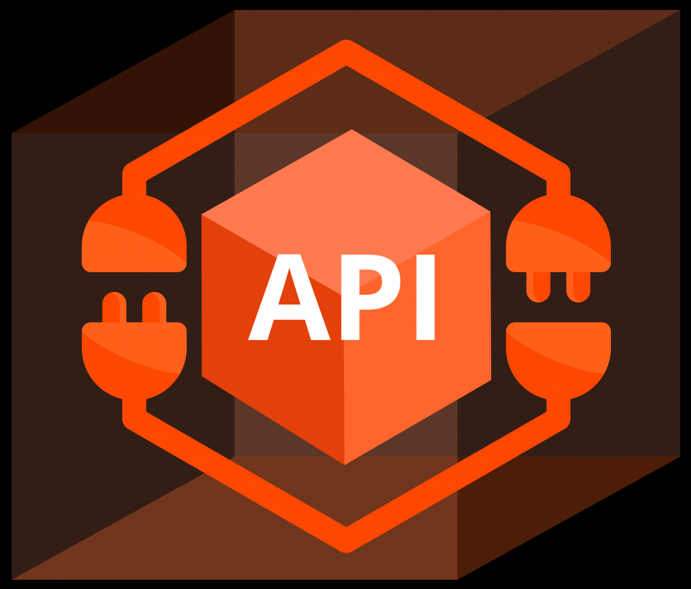
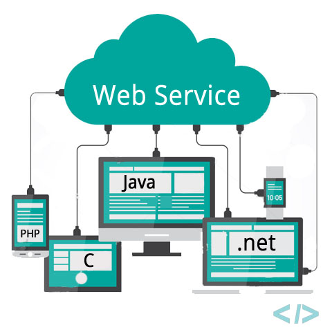

# API

 É a forma que terceiros disponibilizam uma interface de modo que possamos consumir um determinado serviço deles sem nos preocuparmos com a implementação do mesmo.



# Web Services

 É uma API projetada pra se comunicar obrigatóriamente via rede.

Tipicamente, HTTP é o protocolo mais comumente usado para comunicação.



Esse metodo utiliza: SOAP (Simple Object Access Protocol), REST(Representational State Transfer) ou XML-RPC como meio de comunicação. Ou seja, quando uma API precisa enviar dados através da rede, podemos chamar de web service.


```
"Todos Web Services são APIs, mas nem todas APIs são web services."
```
