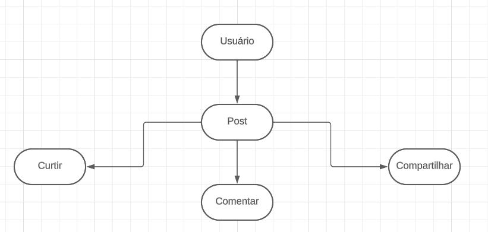

# Como estruturar um REST API?

### Quais recursos que uma API de rede social deve possuir? 

* Criar ou postar mensagens
* Comentar em mensagens
* Curtir mensagens
* Compartilhar mensagem
* CRUD de usuários

  

Create (Criar)

Read (Ler)

Update (Alterar)

Delete (Deletar)

* Criar novo usário
* Ler dados de usuário
* Alterar dados de usuário
* Deletar usuário

# URIs para o sistema em questão

Caso eu queira acessar qualquer usuário especifico, utilizaria a seguinte URI:

/usuarios/{nomeDoUsuario}

URI para todas as postagens do sistema:

/postagens

URI para acessar postagem de um ID especifico:

/postagens/{iD}

URI para todas as postagens de um determinado usuário:

usuarios/{nomeDoUsuario}/postagens

URI para uma postagem especifica de um usuário especifico:

/usuarios/{nomeDoUsuario}/postagens/{ID}
